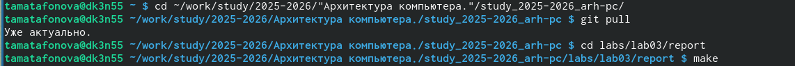

---
author:
  name: Матафонова Таисия Антоновна 
  degrees: НБИбд-01-25
  orcid: 1032253843
  email: 1032253843@pfur.ru
  affiliation:
    - name: Российский университет дружбы народов
      country: Российская Федерация
      postal-code: 115419
      city: Москва
      address: ул.Орджоникидзе , д. 3
title: "Лабораторная работа №3"
subtitle: "Архитектура компьютеров и операционные системы"
license: "CC BY"
editor: 
  markdown: 
    wrap: 72
---

# Цель работы

Целью работы является освоение процедуры оформления отчетов с помощью
легковесного языка разметки Markdown.

# Задание

1.  В соответствующем каталоге сделайте отчёт по лабораторной работе № 3
    в формате Markdown. В качестве отчёта необходимо предоставить отчёты
    в трех форматах: pdf, docx и md.
2.  Загрузите файлы на github.

# Теоретическое введение

Здесь описываются теоретические аспекты, связанные с выполнением работы.

Например, в [табл. @tbl-std-dir] приведено краткое описание стандартных
каталогов Unix.

| Имя каталога | Описание каталога |
|--------------------------|----------------------------------------------|
| `/` | Корневая директория, содержащая всю файловую |
| `/bin` | Основные системные утилиты, необходимые как в однопользовательском режиме, так и при обычной работе всем пользователям |
| `/etc` | Общесистемные конфигурационные файлы и файлы конфигурации установленных программ |
| `/home` | Содержит домашние директории пользователей, которые, в свою очередь, содержат персональные настройки и данные пользователя |
| `/media` | Точки монтирования для сменных носителей |
| `/root` | Домашняя директория пользователя `root` |
| `/tmp` | Временные файлы |
| `/usr` | Вторичная иерархия для данных пользователя |

: Описание некоторых каталогов файловой системы GNU Linux {#tbl-std-dir}

Более подробно про Unix см. в [@tanenbaum_book_modern-os_ru;
@robbins_book_bash_en; @zarrelli_book_mastering-bash_en;
@newham_book_learning-bash_en].

# Выполнение лабораторной работы

1)  Открываем терминал и переходим в каталог курса сформированный при
    выполнении лабораторной работы №2, обновим локальный
    репозиторий,cкачав изменения из удаленного репозитория с помощью
    команды git pull. Перевожу компиляцию шаблона с помощью команды
    make. Сгенерировались файлы report.pdf и report.docx проверяю
    коррекность полученных файлов.

{#fig:001} {#fig:002}

2)Удаляем полученный файл с использованием Makefile. Для этого вводим
команду make clean. После этой команды файлы report.pdf и report.docx
были удалены. Открываем файл report.md c помощью текстового редактора
gedit и начинаем изучать файл:

{#fig:003}

3)Заполняем отчет и скомпилируем отчет с использованием Makefile.
Проверим корректность полученных файлов. Убедимся, что все скриншоты
сохранены в каталоге image:

{#fig:004}

4)Загружаем всё на Github.

# Выводы

В ходе лабораторной работы мы освоили процедуры оформления отчетов с
помощью легковесного языка разметки Markdown: оформление изображений,
генерирование файлов и компелирование отчёта.

# Список литературы {.unnumbered}

ТУИС, "Лабораторная работа № 3. Язык разметки
Markdown"
