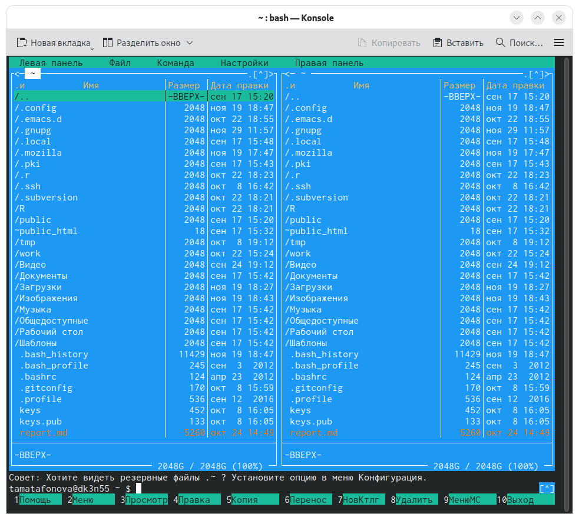
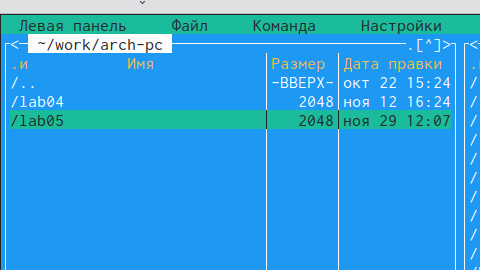
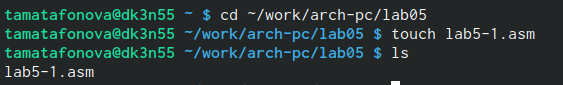
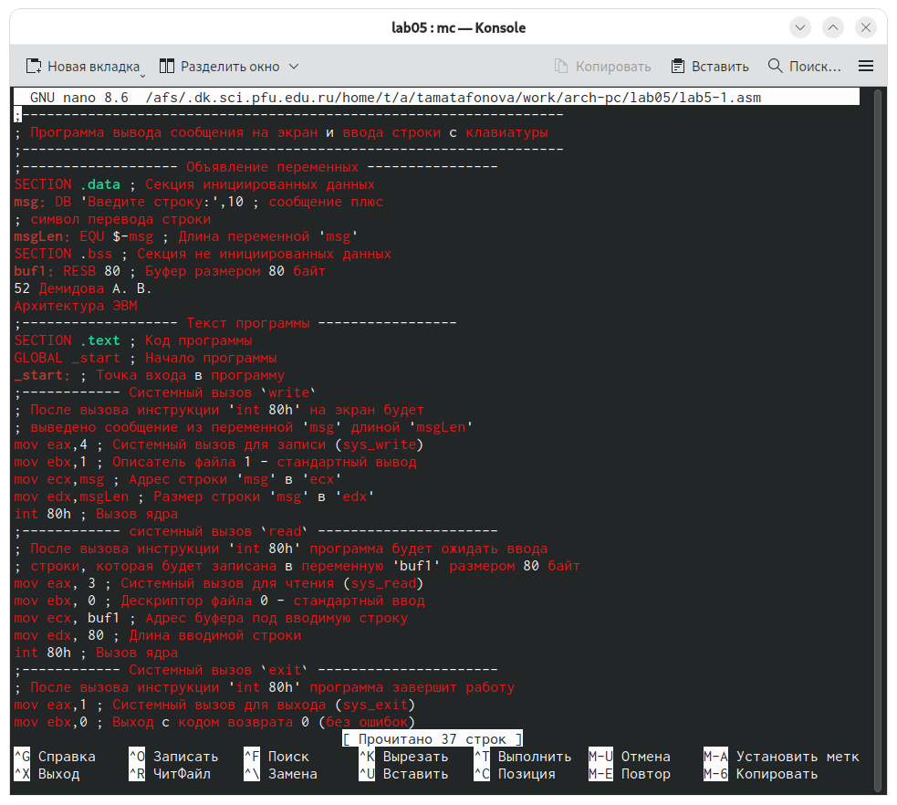
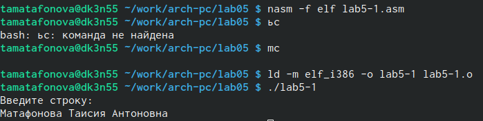
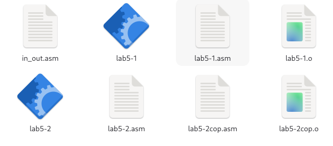
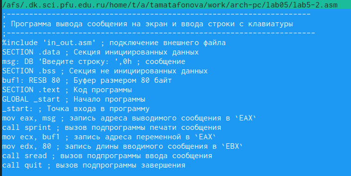
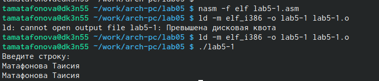
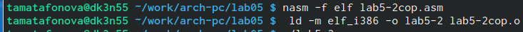

---
author:
  name: Матафонова Таисия Антоновна 
  degrees: DSc
  orcid: 0000-0002-0877-7063
  email: 1032253843@rudn.ru
  affiliation:
    - name: Российский университет дружбы народов
      country: Российская Федерация
      postal-code: 117198
      city: Москва
      address: ул. Миклухо-Маклая, д. 6
title: "Лабораторная работа №5"
subtitle: "Основы работы с
license: "CC BY"
editor: 
  markdown: 
    wrap: 72
---

# Цель работы

Приобретение практических навыков работы в Midnight Commander. Освоение инструкций языка ассемблера mov и int.

# Задание

1.  Создайте копию файла lab5-1.asm. Внесите изменения в программу (без использования внешнего файла in_out.asm), так чтобы она работала по следующему алгоритму: • вывести приглашение типа “Введите строку:”; • ввести строку с клавиатуры; • вывести введённую строку на экран.
2.  Получите исполняемый файл и проверьте его работу. На приглашение ввести строку введите свою фамилию.
3.  Создайте копию файла lab5-2.asm. Исправьте текст программы с использование подпрограмм из внешнего файла in_out.asm, так чтобы она работала по следующему алгоритму: • вывести приглашение типа “Введите строку:”; • ввести строку с клавиатуры; • вывести введённую строку на экран.

# Теоретическое введение

Midnight Commander (или просто mc) — это программа, которая позволяет просматривать структуру каталогов и выполнять основные операции по управлению файловой системой, т.е. mc является файловым менеджером. Midnight Commander позволяет сделать работу с файлами более удобной и наглядной. Для активации оболочки Midnight Commander достаточно ввести в командной строке mc и нажать клавишу Enter (рис. 5.1). В Midnight Commander используются функциональные клавиши F1 — F10 , к которым привязаны часто выполняемые операции (табл. 5.1). Таблица 5.1. Функциональные клавиши Midnight Commander Функциональные клавиши Выполняемое действие F1 вызов контекстно-зависимой подсказки F2 вызов меню, созданного пользователем F3 просмотр файла, на который указывает подсветка в активной панели F4 вызов встроенного редактора для файла, на который указывает подсветка в активной панели 43 Демидова А. В. Архитектура ЭВМ Функциональные клавиши Выполняемое действие F5 копирование файла или группы отмеченных файлов из каталога, отображаемого в активной панели, в каталог, отображаемый на второй панели F6 перенос файла или группы отмеченных файлов из каталога, отображаемого в активной панели, в каталог, отображаемый на второй панели F7 создание подкаталога в каталоге, отображаемом в активной панели F8 удаление файла (подкаталога) или группы отмеченных файлов F9 вызов основного меню программы F10 выход из программы Следующие комбинации клавиш облегчают работу с Midnight Commander: • Tab используется для переключениями между панелями; • ↑ и ↓ используется для навигации, Enter для входа в каталог или открытия файла (если в файле расширений mc.ext заданы правила связи определённых расширений файлов с инструментами их запуска или обработки); • Ctrl + u (или через меню Команда \> Переставить панели ) меняет местами содержимое правой и левой панелей; • Ctrl + o (или через меню Команда \> Отключить панели ) скрывает или возвращает панели Midnight Commander, за которыми доступен для работы командный интерпретатор оболочки и выводимая туда информация. • Ctrl + x + d (или через меню Команда \> Сравнить каталоги ) позволяет сравнить содержимое каталогов, отображаемых на левой и правой панелях. Дополнительную информацию о Midnight Commander можно получить по команде man mc и на странице проекта \[3\]. 5.2.2. Структура программы на языке ассемблера NASM Программа на языке ассемблера NASM, как правило, состоит из трёх секций: секция кода программы (SECTION .text), секция инициированных (известных во время компиляции) данных (SECTION .data) и секция неинициализированных данных (тех, под которые во время компиляции только отводится память, а значение присваивается в ходе выполнения программы) (SECTION .bss). Таким образом, общая структура программы имеет следующий вид: SECTION .data ; Секция содержит переменные, для ... ; которых задано начальное значение 44 Демидова А. В. Архитектура ЭВМ Рис. 5.1. Окно Midnight Commander SECTION .bss ; Секция содержит переменные, для ... ; которых не задано начальное значение SECTION .text ; Секция содержит код программы GLOBAL \_start \_start: ; Точка входа в программу ... ; Текст программы mov eax,1 ; Системный вызов для выхода (sys_exit) mov ebx,0 ; Выход с кодом возврата 0 (без ошибок) int 80h ; Вызов ядра Для объявления инициированных данных в секции .data используются директивы DB, DW, DD, DQ и DT, которые резервируют память и указывают, какие значения должны храниться в этой памяти: • DB (define byte) — определяет переменную размером в 1 байт; • DW (define word) — определяет переменную размеров в 2 байта (слово); • DD (define double word) — определяет переменную размером в 4 байта (двойное слово); • DQ (define quad word)— определяет переменную размером в 8 байт (учетверённое слово); • DT (define ten bytes) — определяет переменную размером в 10 байт. Демидова А. В. 45 Архитектура ЭВМ Директивы используются для объявления простых переменных и для объявления массивов. Для определения строк принято использовать директиву DB в связи с особенностями хранения данных в оперативной памяти. Синтаксис директив определения данных следующий: <имя> DB <операнд> \[, <операнд>\] \[, <операнд>\] Таблица 5.2. Примеры Пример Пояснение a db 10011001b определяем переменную a размером 1 байт с начальным значением, заданным в двоичной системе счисления (на двоичную систему счисления указывает также буква b (binary) в конце числа) b db '!' определяем переменную b в 1 байт, инициализируемую символом ! c db "Hello" определяем строку из 5 байт d dd -345d определяем переменную d размером 4 байта с начальным значением, заданным в десятичной системе счисления (на десятичную систему указывает буква d (decimal) в конце числа) h dd 0f1ah определяем переменную h размером 4 байта с начальным значением, заданным в шестнадцатеричной системе счисления (h — hexadecimal) Для объявления неинициированных данных в секции .bss используются директивы resb, resw, resd и другие, которые сообщают ассемблеру, что необходимо зарезервировать заданное количество ячеек памяти. Примеры их использования приведены в табл. 5.3. 46 Демидова А. В. Архитектура ЭВМ Таблица 5.3. Директивы для объявления неинициированных данных Директива Назначение директивы Аргумент Назначение аргумента resb Резервирование заданного числа однобайтовых ячеек string resb 20 По адресу с меткой string будет расположен массив из 20 однобайтовых ячеек (хранение строки символов) resw Резервирование заданного числа двухбайтовых ячеек (слов) count resw 256 По адресу с меткой count будет расположен массив из 256 двухбайтовых слов resd Резервирование заданного числа четырёхбайтовых ячеек (двойных слов) x resd 1 По адресу с меткой x будет расположено одно двойное слово (т.е. 4 байта для хранения большого числа) 5.2.3. Элементы программирования 5.2.3.1. Описание инструкции mov Инструкция языка ассемблера mov предназначена для дублирования данных источника в приёмнике. В общем виде эта инструкция записывается в виде mov dst,src Здесь операнд dst — приёмник, а src — источник. В качестве операнда могут выступать регистры (register), ячейки памяти (memory) и непосредственные значения (const). В табл. 5.4 приведены варианты использования mov с разными операндами. Демидова А. В. 47 Архитектура ЭВМ Таблица 5.4. Варианты использования mov с разными операндами Тип операндов Пример Пояснение mov <reg>,<reg> mov eax,ebx пересылает значение регистра ebx в регистр eax mov <reg>,<mem> mov cx,\[eax\] пересылает в регистр cx значение из памяти, указанной в eax mov <mem>,<reg> mov rez,ebx пересылает в переменную rez значение из регистра ebx mov <reg>,<const> mov eax,403045h пишет в регистр eax значение 403045h mov <mem>,<const> mov byte\[rez\],0 записывает в переменную rez значение 0 ВАЖНО! Переслать значение из одной ячейки памяти в другую нельзя, для этого необходимо использовать две инструкции mov: mov eax, x mov y, eax Также необходимо учитывать то, что размер операндов приемника и источника должны совпадать. Использование слудующих примеров приведет к ошибке: • mov al,1000h — ошибка, попытка записать 2-байтное число в 1-байтный регистр; • mov eax,cx — ошибка, размеры операндов не совпадают. 5.2.3.2. Описание инструкции int Инструкция языка ассемблера intпредназначена для вызова прерывания с указанным номером. В общем виде она записывается в виде int n Здесь n — номер прерывания, принадлежащий диапазону 0–255. При программировании в Linux с использованием вызовов ядра sys_calls n=80h (принято задавать в шестнадцатеричной системе счисления). 48 Демидова А. В. Архитектура ЭВМ После вызова инструкции int 80h выполняется системный вызов какой-либо функции ядра Linux. При этом происходит передача управления ядру операционной системы. Чтобы узнать, какую именно системную функцию нужно выполнить, ядро извлекает номер системного вызова из регистра eax. Поэтому перед вызовом прерывания необходимо поместить в этот регистр нужный номер. Кроме того, многим системным функциям требуется передавать какие-либо параметры. По принятым в ОС Linux правилам эти параметры помещаются в порядке следования в остальные регистры процессора: ebx, ecx, edx. Если системная функция должна вернуть значение, то она помещает его в регистр eax. 5.2.3.3. Системные вызовы для обеспечения диалога с пользователем Простейший диалог с пользователем требует наличия двух функций — вывода текста на экран и ввода текста с клавиатуры. Простейший способ вывести строку на экран — использовать системный вызов write. Этот системный вызов имеет номер 4, поэтому перед вызовом инструкции int необходимо поместить значение 4 в регистр eax. Первым аргументом write, помещаемым в регистр ebx, задаётся дескриптор файла. Для вывода на экран в качестве дескриптора файла нужно указать 1 (это означает «стандартный вывод», т. е. вывод на экран). Вторым аргументом задаётся адрес выводимой строки (помещаем его в регистр ecx, например, инструкцией mov ecx, msg). Строка может иметь любую длину. Последним аргументом (т.е. в регистре edx) должна задаваться максимальная длина выводимой строки. Для ввода строки с клавиатуры можно использовать аналогичный системный вызов read. Его аргументы –такие же, как у вызова write,только для «чтения» с клавиатуры используется файловый дескриптор 0 (стандартный ввод). Системный вызов exit является обязательным в конце любой программы на языке ассемблер. Для обозначения конца программы перед вызовом инструкции int 80h необходимо поместить в регистр еах значение 1, а в регистр ebx код завершения 0.

# Выполнение лабораторной работы

1.  Открываю Midnight Commander

{#fig:001}

2.Перехожу в каталог \~/work/study/2022-2023/Архитектура Компьютера/arch-pc, используя файловый менеджер mc

{#fig:002}

3.С помощью функциональной клавиши F7 создаю каталог lab05

{#fig:003}

4.В строке ввода прописываю команду touch lab5-1.asm, чтобы создать файл, в котором буду работать

{#fig:004}

5.С помощью функциональной клавиши F4 открываю созданный файл для редактирования в редакторе nano и ввожу в файл код программы для запроса строки у пользователя, сохраняя изменения. Далее используя клавишу F3 ткрываю файл для просмотра, чтобы проверить, содержит ли файл текст программы

{#fig:005}

6.Транслирую текст программы файла в объектный файл командой nasm -f elf lab5-1.asm. Создался объектный файл lab5-1.o. Выполняю компоновку объектного файла с помощью команды ld -m elf_i386 -o lab5-1 lab5-1.o. Запускаю исполняемый файл. Программа выводит строку "Введите строку: " и ждет ввода с клавиатуры, я ввожу свои ФИО, на этом программа заканчивает свою работу

{#fig:006}

7.  Скачиваю файл in_out.asm со страницы курса в ТУИС. Он сохранился в каталог "Загрузки".С помощью функциональной клавиши F5 копирую файл in_out.asm из каталога Загрузки в созданный каталог lab05. С помощью функциональной клавиши F5 копирую файл lab5-1 в тот же каталог, но с другим именем, для этого в появившемся окне mc прописываю имя для копии файла.

{#fig:007}

8.Изменяю содержимое файла lab5-2.asm во встроенном редакторе nano и транслирую текст программы файла в объектный файл

{#fig:008}

9.Создайю копию файла lab5-1.asm. Вношу изменения в программу (без использования внешнего файла in_out.asm), так чтобы она работала по алгоритму. Получаю исполняемый файл и проверяю его работу.

{#fig:009}

10.Создаю копию файла lab5-2.asm. Исправляю текст программы с использование подпрограмм из внешнего файла in_out.asm, так чтобы она работала по алгоритму. Создайю исполняемый файл и проверяю его работу

{#fig:010}

{#fig:011}

# Выводы

При выполнении данной лабораторной работы я приобрела практические навыки работы в Midnight Commander, а также освоила инструкции языка ассемблера mov и int.

# Список литературы {.unnumbered}

1.ТУИС РУДН "Лабораторная работа №5. Основы работы с Midnight Commander (mc). Структура программы на языке ассемблера NASM. Системные вызовы в ОС GNU Linux"
